

##  Schweizer QR Einzahlungsschein 

### Generieren eines Schweizer QR Einzahlungsscheins
### Generieren einer Crypto Zahlung (Scannen mit dem Handy)
Generieren eines Kontakts (Scannen mit dem Handy)
Generieren einer Wifi Adresse (Scannen mit dem Handy)
Generieren eines Kalender Eintrags (Scannen mit dem Handy oder in Email einfügen)
Generieren einer URL Adresse  (Scannen mit dem Handy)
Generieren einer Email Adresse (Scannen mit dem Handy)
Generieren einer Telefon Nummer (Scannen mit dem Handy)
Generieren einer SMS Meldung (Scannen mit dem Handy)
Generieren eines Standorts (Scannen mit dem Handy)
Generieren eines Youtube Links (Scannen mit dem Handy)

    Kompiliert mit Lazarus für Ubuntu, MacOS und Windows

<!-- TABLE OF CONTENTS -->

  
<h2 style="display: inline-block">:scroll: INHALT</h2>

  <ol>
    <li><a href="#description">Beschreibung</a></li>
    <li><a href="#windows">Einzahlunsschein</a>
      <ul>
      <li><a href="#swisspay">Eingabe (Unlizensiert)</a></li>
      <li><a href="#paywindow">Einzahlungsschein</a></li>
      <li><a href="#konten">Eingabe (Lizensiert)</a></li>
      <li><a href="#adresses">Adressen (Lizensiert)</a></li>
      </ul>
    </li>
    <li><a href="#crypto">Crypto Zahlungen</a>
      <ul>
      <li><a href="#crypto">Eingabe</a></li>
      <li><a href="#cryptocode">QR Code</a></li>
      </ul>
    </li>
    <li><a href="#contact">Kontakt</a>
      <ul>
      <li><a href="#contact">Eingabe</a></li>
      <li><a href="#contactcode">QR Code</a></li>
      </ul>
    </li>
    <li><a href="#wifi">Wifi</a>
      <ul>
      <li><a href="#wifi">Eingabe</a></li>
      <li><a href="#wificode">QR Code</a></li>
      </ul>
    </li>
    <li><a href="#calendar">Kalender</a>
      <ul>
      <li><a href="#calendar">Eingabe</a></li>
      <li><a href="#calendarcode">QR Code</a></li>
      </ul>
    </li>
    <li><a href="#url">Url</a>
      <ul>
      <li><a href="#url">Eingabe</a></li>
      <li><a href="#urlcode">QR Code</a></li>
      </ul>
    </li>
    <li><a href="#email">Email</a>
      <ul>
      <li><a href="#email">Eingabe</a></li>
      <li><a href="#emailcode">QR Code</a></li>
      </ul>
    </li>
    <li><a href="#tel">Telefon</a>
      <ul>
      <li><a href="#tel">Eingabe</a></li>
      <li><a href="#telcode">QR Code</a></li>
      </ul>
    </li>
    <li><a href="#sms">SMS</a>
      <ul>
      <li><a href="#sms">Eingabe</a></li>
      <li><a href="#smscode">QR Code</a></li>
      </ul>
    </li>
    <li><a href="#geo">GEO</a>
      <ul>
      <li><a href="#geo">Eingabe</a></li>
      <li><a href="#geocode">QR Code</a></li>
      </ul>
    </li>
    <li><a href="#youtube">Youtube</a>
      <ul>
      <li><a href="#youtube">Eingabe</a></li>
      <li><a href="#youtubecode">QR Code</a></li>
      </ul>
    </li>
    <li><a href="#change">Änderungsprotokoll</a></li>
    <li><a href="#license">Lizenz bestellen</a></li>
    <li><a href="#downloads">Download</a></li>
    <li><a href="#nachweise">Einzelnachweise</a></li>
  </ol>

### :mag: Beschreibung

   `qrcode [--swisspay] [--konto=N|--adresse=filename.txt] [--admin] [--jpg] [--print]<Enter>`

   `qrcode [--vcard|wifi|calendar|url|email|phone|sms|geo|youtube]<Enter>`

   `qrcode [--license]<Enter>`

Parameter|Beschreibung
---------|------------
`--swissppay`|Einzahlungsschein Formular öffnen
`--konto=N`|Empfängerkonto auswählen
`--adresse=filename.txt`|Zahlungspflichtige und Empfängerkonto aus Datei lesen
`--admin`|Konten speichern aktivieren
`--jpg`|JPG-Datei erstellen
`--print`|Einzahlungsschein ausdrucken

 Parameter|Beschreibung
---------|------------
`--crypto`|Cryptowährungs code erzeugen
`--vcard`|Kontakt code erzeugen
`--wifi`|WIFI code erzeugen
`--calendar`|Kalender code erzeugen
`--url`|URL code erzeugen
`--email`|Email code erzeugen
`--phone`|Telefon code erzeugen
`--sms`|SMS code erzeugen (QRcode mit Handy scannen und senden)
`--geo`|GEO code rezeugen
`--youtube`|Youtube ID code erzeugen

 Parameter|Beschreibung
---------|------------
`--license`|Lizenz eingeben und speichern

:heavy_exclamation_mark: Parameter lassen sich nur mit einer `Lizensierten-Version` ausführen.

:heavy_exclamation_mark: Mit der `Unlizensierte-Version` müssen die Daten `manuell` eingetragen werden.

Wenn `--adresse=` verwendet wird, kann `--konto=` weggelassen werden, da das Konto in der Adressliste enthalten sein muss.
- Linux &nbsp;&nbsp;= ~/qrcode/EZ/rechnung.txt
- MacOS &nbsp;&nbsp;= ~/qrcode/EZ/rechnung.txt
- Windows = %APPDATA%\qrcode\EZ\rechnung.txt

Mit den Parametern `--jpg` und/oder `--print` werden die Daten automatisch verarbeitet und die entsprechenden Daten erzeugt, danach wird das Programm beendet.

Es ist `KEINE Internetverbindung notwendig` zum erzeugen der Einzahlungsscheine.

Daten Verzeichnis für gespeicherte Einzahlungsscheine :
  - Linux `~/qrcode/EZ/` 
  - MacOS `~/qrcode/EZ/` 
  - Windows `%APPDATA%\qrcode\EZ\`

Konfigurationsdatei :
  - Linux `~/qrcode/qrcode.conf` 
  - MacOS `~/qrcode/qrcode.conf` 
  - Windows `HKCU\Software\unattended.ch\QRcode`

   [goto TOC](#toc)

## WINDOWS

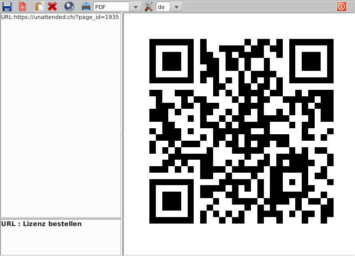

[Link : QRCODE Lizenz bestellen](https://unattended.ch/?page_id=1935)

### :computer: Einzahlungsschein Eingabe (Unlizensiert)

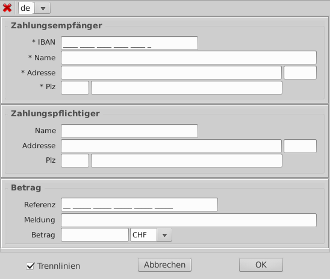

:heavy_exclamation_mark: `Mit der Unlizensierten-Version müssen die Daten manuell eingegeben werden.`

  - Nach der Eingabe der IBAN wird die Farbe des Feldes verändert 
    GRÜN=IBAN korrekt 
    ROT&nbsp;&nbsp;&nbsp;=IBAN Fehlerhaft 
  - Nach Eingabe der Referenz wird die Farbe des Feldes verändert 
    GRÜN=Referenz korrekt 
    ROT&nbsp;&nbsp;&nbsp;=Referenz fehlerhaft 
  - \<OK>-Taste erstellt den Einzahlungsschein
  - \<Abbrechen>-Taste Fenster schliessen
  - Es können 4 Sprachen ausgewählt werden en,de,fr,it 
    In diesen Sprachen kann der Einzahlungsschein erstellt werden.

  [goto TOC](#toc)

### :computer: Einzahlungsschein

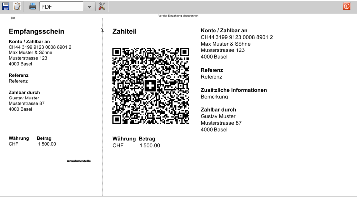

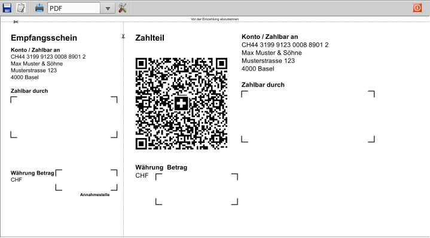

 Speichern 
 Zwischenablage 
 Drucken 
 Setup 
 Beenden

   [goto TOC](#toc)

### :wrench: Einzahlungsschein Eingabe (Lizensiert)

:heavy_exclamation_mark: `Die Konten können nur mit der Lizensierten-Version gespeichert und geladen werden.`

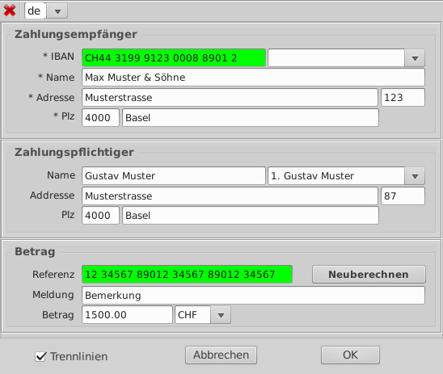

  - Zahlungsempfänger speichern
    - Die Zahlungsempfänger Kontodaten eintragen und <Speichern> drücken.
    - Danach wird das Konto automatisch in die Auswahlliste geladen
      und kann über diese ausgewählt werden.
    - Es können maximal 8 Konten gespeichert werden.
    - Über die Kommandozeile kann man das Konto mit --konto=N (1=Eins,2=Zwei...) auswählen.
  
  - Nach der Eingabe der IBAN wird die Farbe des Feldes verändert
    - GRÜN=IBAN korrekt 
    - ROT&nbsp;&nbsp;&nbsp;=IBAN Fehlerhaft 
  
  - Nach Eingabe der Referenz wird die Farbe des Feldes verändert
    - GRÜN=Referenz korrekt 
    - ROT&nbsp;&nbsp;&nbsp;=Referenz fehlerhaft
  
  - Um eine eigene Referenznummer zu erstellen, muss die Nummer eigegeben werden. 
    Und dann kann mit <Neuberechnen> die Prüfziffer berechnet werden. 
    - 12 34567 89012 34567 89012 3456`0`
    - PK`00` 1234 5678 9012 3456 7890 1
  
  - \<OK>-Taste erstellt den Einzahlungsschein
  - \<Abbrechen>-Taste Fenster schliessen

  - Es können 4 Sprachen ausgewählt werden en,de,fr,it 
    In diesen Sprachen kann der Einzahlungsschein erstellt werden.

[goto TOC](#toc)

### :wrench: Adressen (Lizensiert)

:heavy_exclamation_mark: `Die Adressen können nur mit der Lizensierten-Version aus einer Textdatei geladen werden.`

  - Dazu muss jeder Datensatz aus 10 Zeilen bestehen.
  - Falls mehr als 1 Datensatz übertragen werden soll, muss eine Trennzeile `###` eingesetzt werden.
  - Als Abschluss muss eine Leerzeile folgen.
  - Über die Kommandozeile kann man die Datei mit --adresse=filename.txt laden.
  - Es können maximal 64 Adressen verarbeitet werden.
  - Alle Zeilen mit `***` müssen ausgefüllt sein, alle anderen können leer sein.
 

  Aufbau :

	 1. Empfänger Konto (1=Eins,2=Zwei...) ***
	 2. Name
	 3. Adresse
	 4. Hausnummer
	 5. Postleitzahl
	 6. Ort
	 7. Referenznummer
	 8. Bemerkung
	 9. Währung (CHF/EUR) ***
	10. Betrag
	11. Leerzeile oder Trenzeile '###' ***

Datei adressen.txt :

<pre>
1
Gustav Muster
Musterstrasse
87
4000
Basel
00 00000 00000 00000 00000 00000
Bemerkung
CHF
1500.00
###
1
Frank Muster
Musterstrasse
22
4000
Basel
00 00000 00000 00000 00000 00000
Bemerkung
CHF
999.00

</pre>

   [goto TOC](#toc)

### Crypto Zahlungen

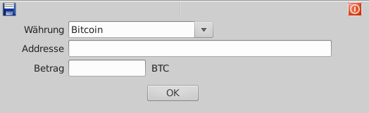

### Crypto Code

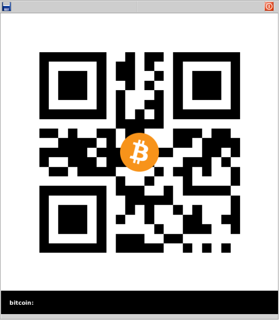

   [goto TOC](#toc)

### Kontakt

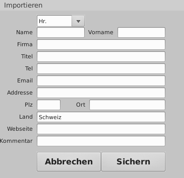

### Kontakt Code

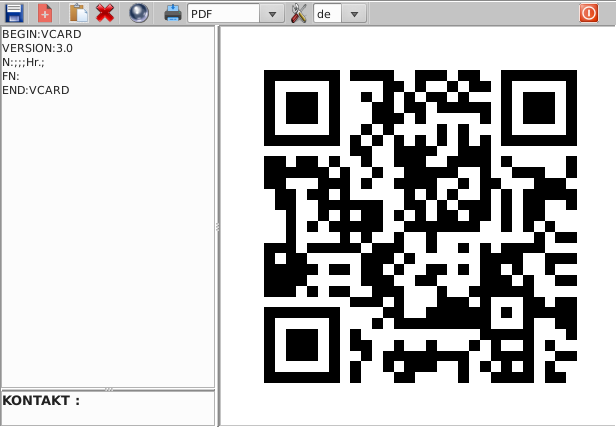

   [goto TOC](#toc)

### Wifi

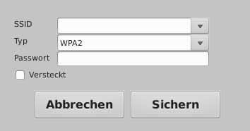

### Wifi Code

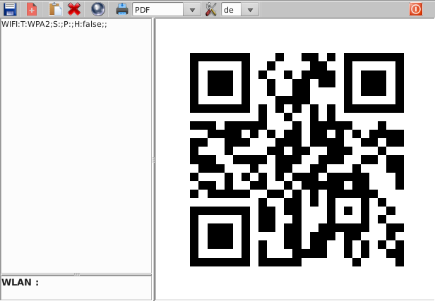

   [goto TOC](#toc)

### Kalender

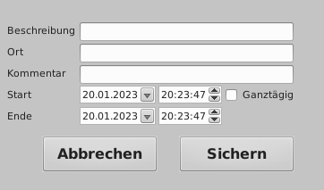

### Kalender Code

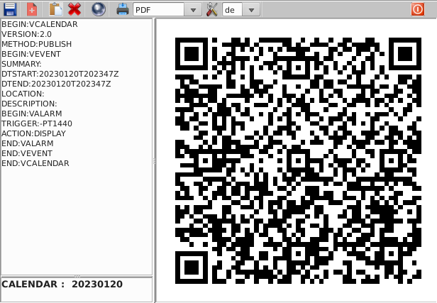

   [goto TOC](#toc)

### Url

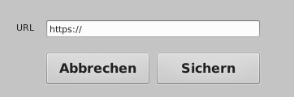

### Url Code

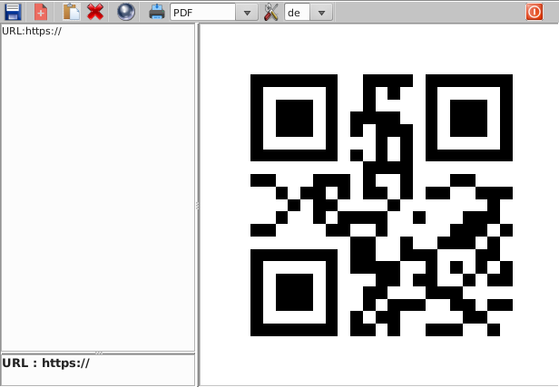

   [goto TOC](#toc)

### Email

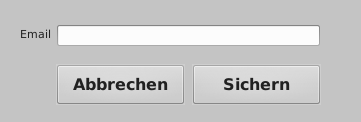

### Email Code

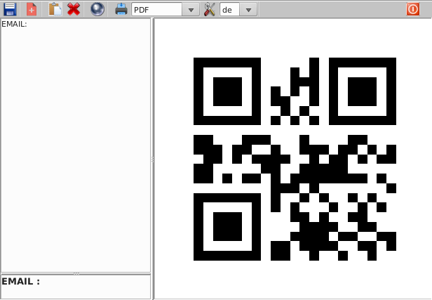

   [goto TOC](#toc)

### Telefon

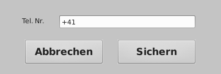

### Telefon Code

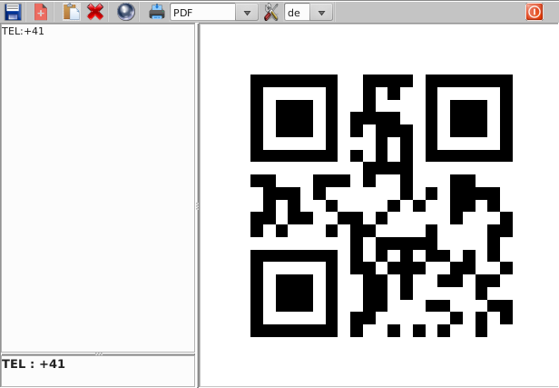

   [goto TOC](#toc)

### SMS

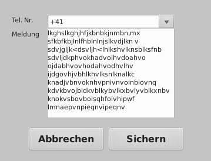

### SMS Code

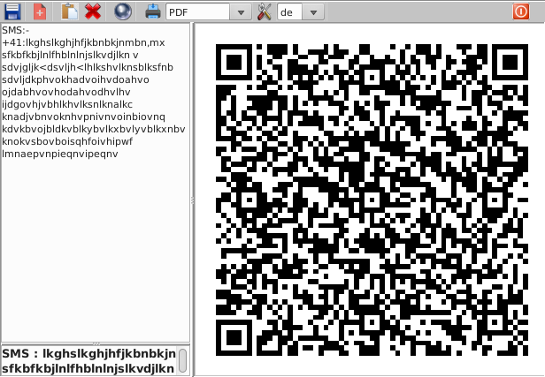

   [goto TOC](#toc)

### GEO

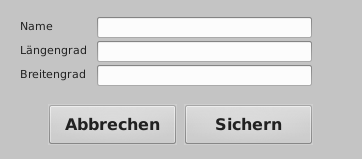

### GEO Code

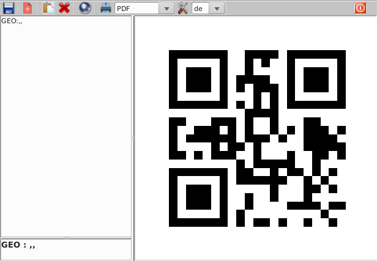

   [goto TOC](#toc)

### Youtube

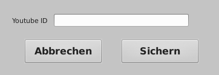

### Youtube Code

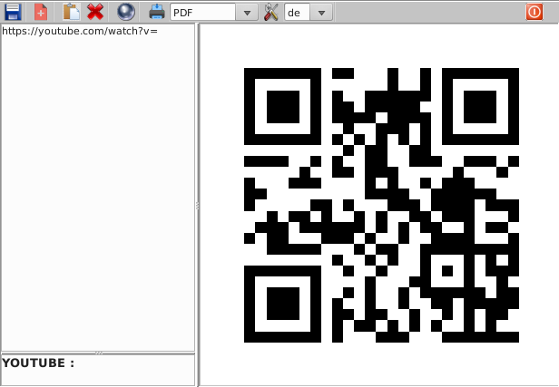

   [goto TOC](#toc)

## :recycle: Änderungsprotokoll
[Changelog](/CHANGELOG)

### :warning: Lizenz bestellen

[Lizenz bestellen, mit Einzahlungsschein bezahlen](https://unattended.ch/?page_id=1935) 
[Lizenz bestellen, mit Bitcoin bezahlen](https://btcpay.3quenz.ch/apps/2DM1ibuoDbPM1WTnHvui1qyE3UZJ/pos)

### :dvd: Download

### Einzelnachweise
[Wikipedia QR-Rechnung](https://de.wikipedia.org/wiki/QR-Rechnung) abgerufen am 15. Januar 2023 
[Wikipedia QR-Code](https://de.wikipedia.org/wiki/QR_code) abgerufen am 15. Januar 2023 
[SIX Style Guide](https://www.paymentstandards.ch/dam/downloads/style-guide-de.pdf) abgerufen am 15. Januar 2023

   [goto TOC](#toc)

