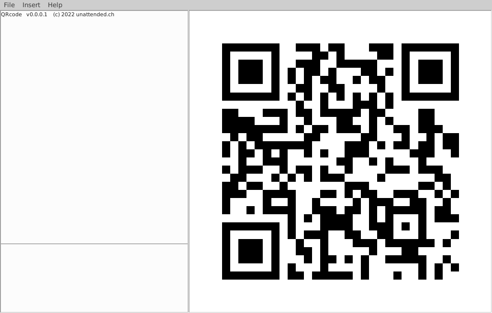

## QRCODE

    QRcode generator

    Compiled with Lazarus for Ubuntu, Raspian, MacOS and Windows

   [vide alios et bene quod opus est cogitare](https://www.google.ch/search?q=%22vide+alios+et+bene+quod+opus+est+cogitare%22+deutsch)

<!-- TABLE OF CONTENTS -->

  
<h2 style="display: inline-block">TABLE OF CONTENTS</h2>

  <ol>
    <li><a href="#windows">Windows</a></li>
    <li><a href="#description">Description</a></li>
    <li><a href="#language">Language</a></li>
    <li><a href="#download">Download</a></li>
  </ol>

## WINDOWS
### Main Window

   [goto TOC](#toc)

## DESCRIPTION

    qrcode <Enter>

   Select `Insert` from menu and then one of the following :

    - Calendar entry
    - Contact information
    - URL address
    - Email address
    - Phone number
    - SMS message
    - Wlan information
    - Geo location
    - Youtube ID

   Or type any text

   Select `File` from menu :

   - Open Text `load previously saved text from ~/qrcode/txt`

   - Save Jpeg `save jpeg to ~/qrcode/jpg and text to ~/qrcode/txt`
   - Save vCard `save vCard to ~/qrcode/vcf`

   In `Contact window` select `Import` from menu to load a saved vCard

   Saving location for Unix is `~/qrcode`

   Saving location for Windows is `%APPDATA%\qrcode`

   Configuration for Unix `~/qrcode/qrcode.conf`

   Configuration for Windows Registry `HKCU\SOFTWARE\unattended.ch\qrcode`

   DblClick on Qrcode image will copy bitmap to clipboard

   [goto TOC](#toc)

## LANGUAGE

   You can change the default language in qrcode.conf [Setup] Lang=[en|de|fr|it]

   Language files can be found in [locale](/locale)

   Please feel free to add you own language

## DOWNLOAD

       - Ubuntu installer package          (qrcode_VERSION_amd64.deb)
       - Raspberry installer package       (qrcode_VERSION_armhf.deb)
       - MacOS installer package           (qrcode_VERSION_mac64.dmg)
       - Windows installer package         (qrcode_VERSION_setup.exe)

   [goto TOC](#toc)

[releases]: https://github.com/unattended-ch/qrcode/releases

[lazarus]: https://www.lazarus-ide.org/
